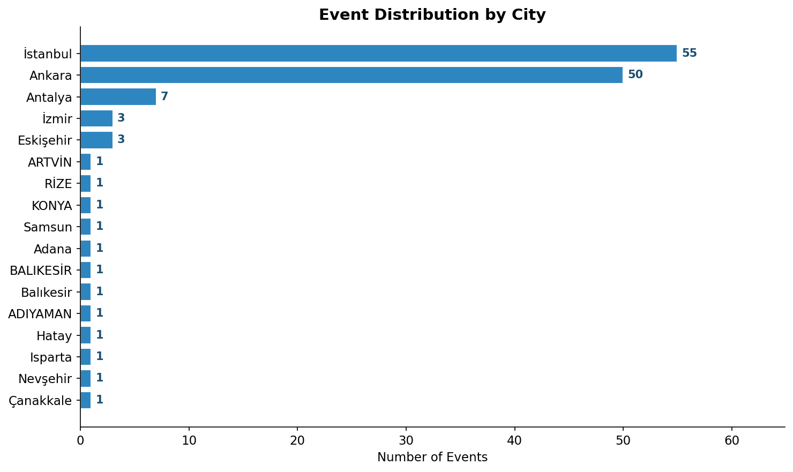
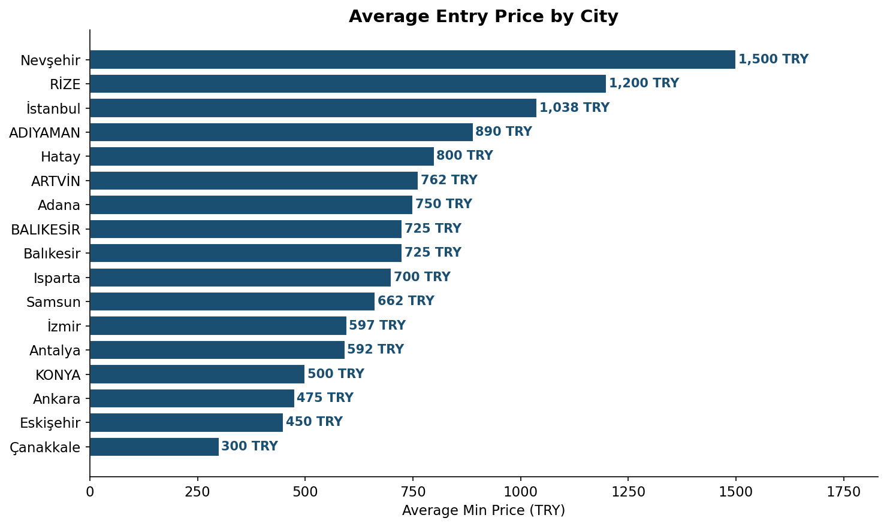
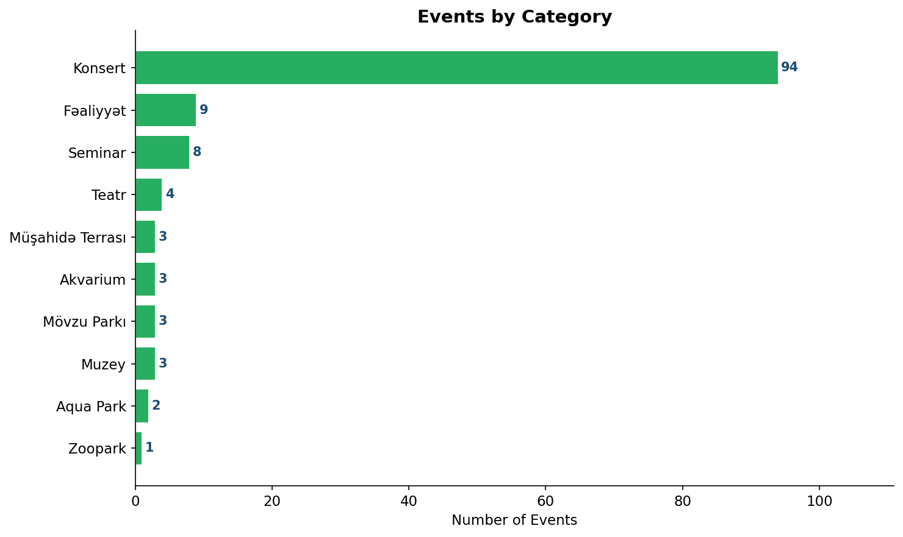
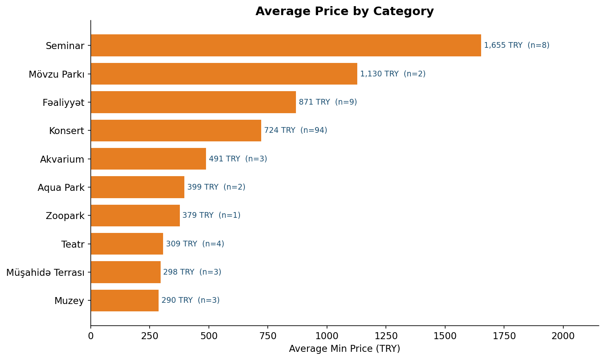
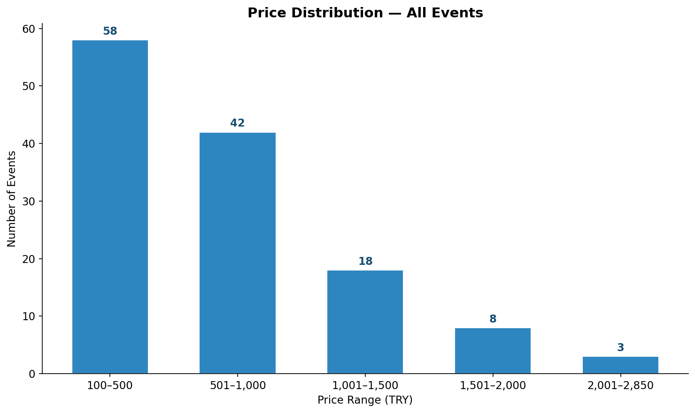
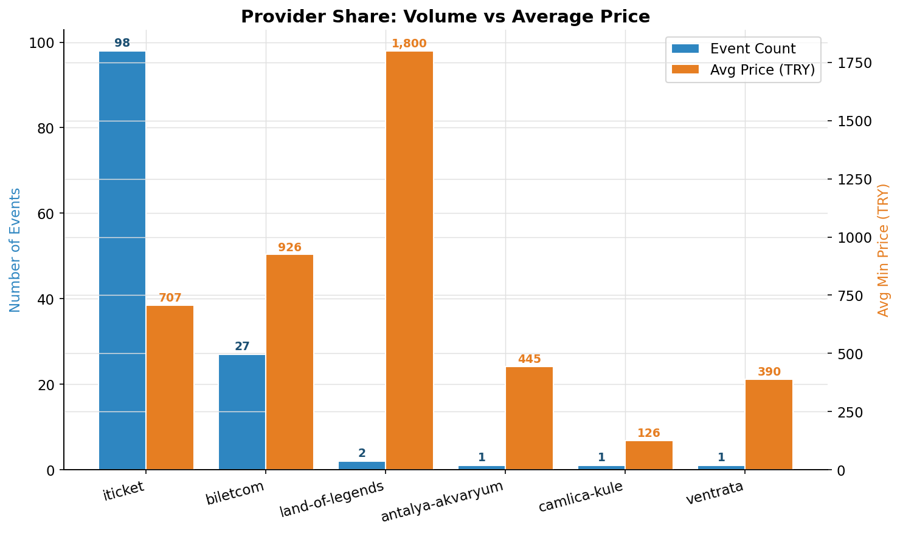
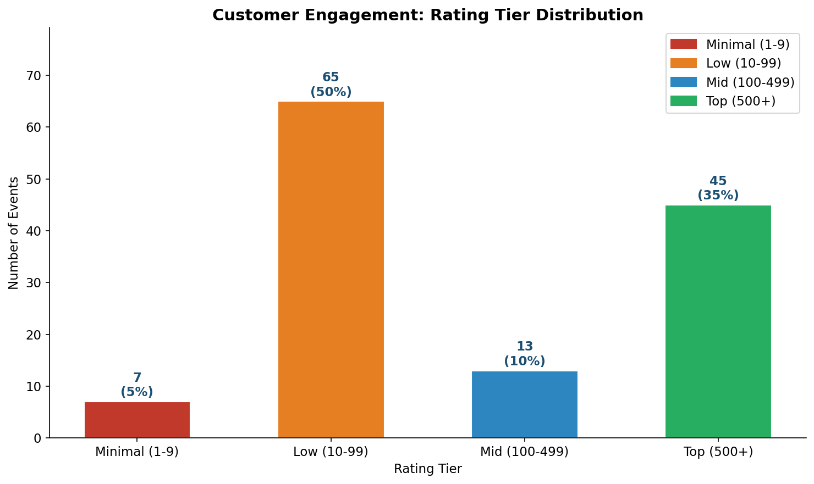

# az.bilet.com — Business Analysis Report
**Dataset:** 130 active entertainment events · Turkey · Prices in TRY
**Generated:** February 2026

---

## 1. Executive Summary

az.bilet.com's Turkish entertainment catalogue is heavily concentrated in two cities (Istanbul + Ankara = 81% of inventory) and one content type (Konsert = 72%). Istanbul commands a 2.2× price premium over Ankara. Only 17% of events carry a discount, leaving significant promotional capacity untapped. Three-quarters of all events are sourced through a single provider (iTicketTR), creating a dependency risk. Customer engagement is polarised: 35% of events have strong ratings (500+), while 50% sit in the low tier (10–99).

---

## 2. Geographic Footprint

| City | Events | Avg Min Price (TRY) |
|---|---|---|
| Istanbul | 55 | 1,038 |
| Ankara | 50 | 475 |
| Antalya | 7 | 592 |
| Izmir | 3 | 597 |
| Other cities | 15 | varies |

**Insight:** Istanbul generates roughly 2.2× the average ticket revenue of Ankara despite a similar event volume. Smaller markets (Nevşehir 1,500 TRY, Rize 1,200 TRY) suggest high-value niche opportunities that are under-represented in the catalogue.

---

## 3. Portfolio Composition

| Category | Events | Share |
|---|---|---|
| Konsert | 94 | 72% |
| Faaliyet (Activity) | 9 | 7% |
| Seminar | 8 | 6% |
| Teatr (Theatre) | 4 | 3% |
| Other (6 types) | 15 | 12% |

**Insight:** Concert dominance creates revenue concentration risk. Attraction categories (aquariums, theme parks, observation decks) represent only 11 events combined — a significant white space given their strong repeat-visit economics.

---

## 4. Pricing Landscape

| Statistic | Value |
|---|---|
| Median min price | 550 TRY |
| Mean min price | 752 TRY |
| Lowest | 100 TRY |
| Highest | 2,850 TRY |

**Price bucket breakdown:**
- **100–500 TRY** — largest cohort; mass-market events
- **501–1,000 TRY** — mainstream concerts and activities
- **1,001–2,850 TRY** — premium experiences (seminars, theme parks)

**Insight:** Seminars average 1,655 TRY — the highest of any category — yet make up only 6% of the catalogue. Theme parks (avg 1,130 TRY) and Activities (avg 871 TRY) are the next-highest tiers. The bulk of inventory clusters in the 100–1,000 TRY band (approx. 75% of events).

---

## 5. Discounting Strategy

| Metric | Value |
|---|---|
| Events with active discount | 22 / 130 (17%) |
| Events at full price | 108 / 130 (83%) |
| Average discount depth | 22% |
| Active coupon codes | 0 |

**Insight:** Discounting is used sparingly and unevenly across categories. With zero active coupon codes site-wide, the promotional toolkit is essentially unused. A targeted 15–20% flash-discount campaign on low-engagement events could meaningfully increase conversion without eroding margin on premium inventory.

---

## 6. Provider Dependency

| Provider | Events | Share | Avg Price (TRY) |
|---|---|---|---|
| iTicketTR | 98 | 75% | 707 |
| biletcom (native) | 27 | 21% | 926 |
| Land of Legends | 2 | 2% | 1,800 |
| Other providers | 3 | 2% | ~441 |

**Insight:** Three-quarters of the catalogue depends on a single external provider (iTicketTR). Native biletcom events command a 31% price premium (926 vs 707 TRY) and likely carry better margin. Diversifying the supplier base would reduce concentration risk and grow the higher-margin native inventory.

---

## 7. Customer Engagement

| Rating Tier | Events | Share |
|---|---|---|
| Top (500+ ratings) | 45 | 35% |
| Mid (100–499) | 13 | 10% |
| Low (10–99) | 65 | 50% |
| Minimal (1–9) | 7 | 5% |

**Insight:** Only 35% of events have strong social proof (500+ ratings). Half the catalogue is in the low tier — a signal of either low actual attendance, poor review-request flows, or recently added listings. Events with robust ratings typically show stronger conversion rates; improving review capture across mid-tier events is a high-ROI lever.

---

## 8. Strategic Recommendations

1. **Diversify the content portfolio** — Increase non-concert categories (attractions, theatre, family activities) from the current 28% to at least 40%. These categories show strong repeat-visit economics and higher average prices.

2. **Activate the discounting lever** — Deploy targeted time-limited discounts (15–20%) on low-engagement, full-price events, particularly in the 50 Low-tier events that have no current discount. Set up at least one active coupon code campaign per quarter.

3. **Grow native biletcom inventory** — Native events yield 31% higher prices than iTicketTR events. Reducing the iTicketTR share from 75% to 60% by onboarding direct venue partnerships would improve margin and reduce supply-chain risk.

4. **Invest in secondary cities** — Cities like Nevşehir (avg 1,500 TRY), Rize (1,200 TRY), and Hatay (800 TRY) show strong price points but have only 1 event each. Even 3–5 events per high-value secondary city would improve geographic resilience.

5. **Improve review capture** — 55% of events have fewer than 100 ratings. Implement post-event automated review requests for all event types. Prioritise the 65 "Low" tier events; moving even half of them to "Mid" tier would materially strengthen catalogue credibility.

---

*Charts generated by `scripts/generate_charts.py` from `data/data.csv`.*
